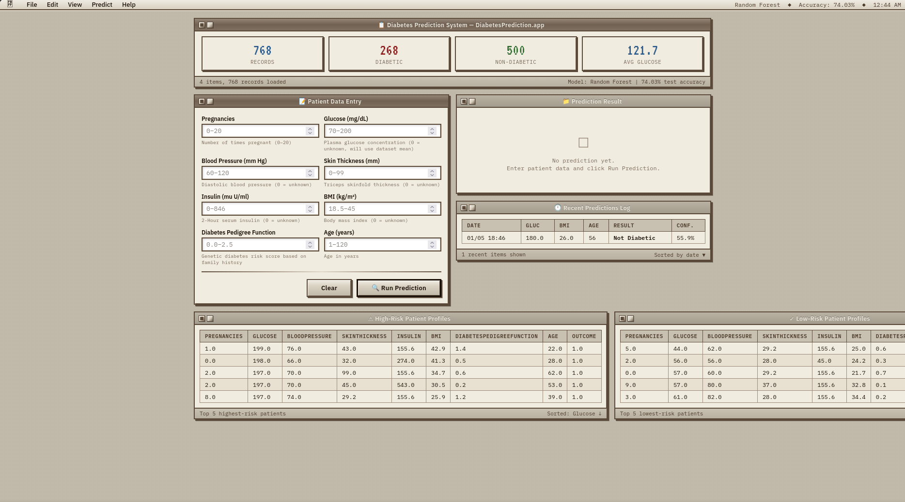
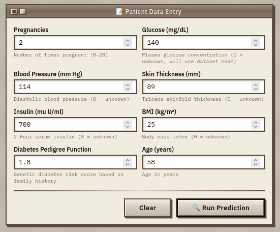
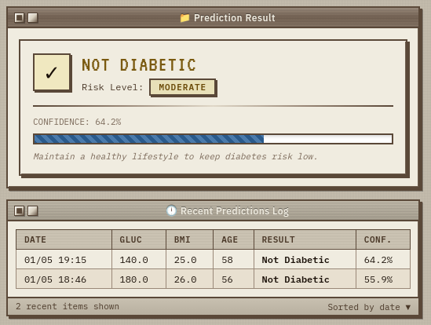

# 🩺 DPS — Diabetes Prediction System

A machine learning-powered web application that predicts the likelihood of diabetes using clinical biomarkers. Built with Django and trained on the **PIMA Indian Diabetes Dataset**.

---

## 📌 About the Project

This is a **Minor Project** submitted as part of the academic curriculum for:

| Detail | Info |
|---|---|
| **Program** | B.Tech — Computer and Data Science (CDS) |
| **Institution** | Maharishi University of Information Technology (MUIT) |
| **Batch** | 2023 – 2027 |
| **Semester** | 6th Semester |
| **Project Type** | Minor Project |

---

## 👨‍💻 Team Members

| Name | GitHub |
|---|---|
| Arpit Kumar | [@arpitkumar1275hacker](https://github.com/arpitkumar1275hacker) |
| Kanak Sharma | [@bhavya132006](https://github.com/bhavya132006) |
| Ravada Siddharth | [@Sidvortex](https://github.com/Sidvortex) |

---

## ✨ Features

- 🔮 Real-time diabetes risk prediction using a trained ML model
- 📊 Confidence score and risk level (High / Moderate / Low) for every prediction
- 🧠 Smart zero-value handling — missing values are auto-replaced with dataset means
- 📋 Clinical input form with validation for all 8 biomarkers
- 📈 Dashboard with dataset statistics (total records, diabetic vs healthy split)
- 🗂️ Prediction history stored in SQLite database
- 👥 Top high-risk and low-risk patient profiles from the PIMA dataset

---

## 🖼️ UI Snapshots

| Dashboard | Prediction Form | Result |
|---|---|---|
|  |  |  |

---

## 🛠️ Tech Stack

- **Backend:** Python, Django
- **Machine Learning:** scikit-learn, NumPy, Pandas
- **Frontend:** HTML, Bootstrap, Django Templates
- **Database:** SQLite3
- **Dataset:** PIMA Indian Diabetes Dataset (768 records)
- **Model Storage:** Pickle (`.pkl` bundle)

---

## 📂 Project Structure

```
DPS/
├── manage.py
├── db.sqlite3
├── screenshots/                  # UI snapshots
├── docs/                         # synopsis, ppt & documentations
├── diabetes_project/
│   ├── settings.py
│   ├── urls.py
│   ├── wsgi.py / asgi.py
│   ├── diabetes.csv              # PIMA dataset
│   └── diabetes_model_bundle.pkl # Trained ML model + scaler
└── predictor/
    ├── ml_service.py             # ML inference engine
    ├── models.py                 # Prediction history model
    ├── forms.py                  # Clinical input form
    ├── views.py                  # Request handling
    ├── urls.py                   # URL patterns
    ├── admin.py
    ├── templates/
    └── migrations/
```

---

## ⚙️ Installation & Setup

**Prerequisites:** Python 3.10+ and pip

**1. Clone the repository**
```bash
git clone https://github.com/Sidvortex/DPS.git
cd DPS
```

**2. Create and activate a virtual environment**
```bash
python -m venv venv

# Windows
venv\Scripts\activate

# macOS / Linux
source venv/bin/activate
```

**3. Install dependencies**
```bash
pip install django scikit-learn numpy pandas
```

**4. Apply migrations**
```bash
python manage.py makemigrations
python manage.py migrate
```

**5. Run the server**
```bash
python manage.py runserver
```

Open your browser and go to: **http://127.0.0.1:8000/**

---

## 📊 Dataset

The model is trained on the **PIMA Indian Diabetes Dataset** from the National Institute of Diabetes and Digestive and Kidney Diseases (NIDDK).

| Feature | Description |
|---|---|
| Pregnancies | Number of times pregnant (0–20) |
| Glucose | Plasma glucose concentration mg/dL |
| BloodPressure | Diastolic blood pressure mm Hg |
| SkinThickness | Triceps skinfold thickness mm |
| Insulin | 2-Hour serum insulin mu U/ml |
| BMI | Body mass index kg/m² |
| DiabetesPedigreeFunction | Genetic diabetes risk score |
| Age | Age in years |

---

## ⚠️ Disclaimer

This project is for **educational purposes only** and is not a substitute for professional medical advice or diagnosis.

---

## 📄 License

This project is licensed under the [MIT License](LICENSE).
