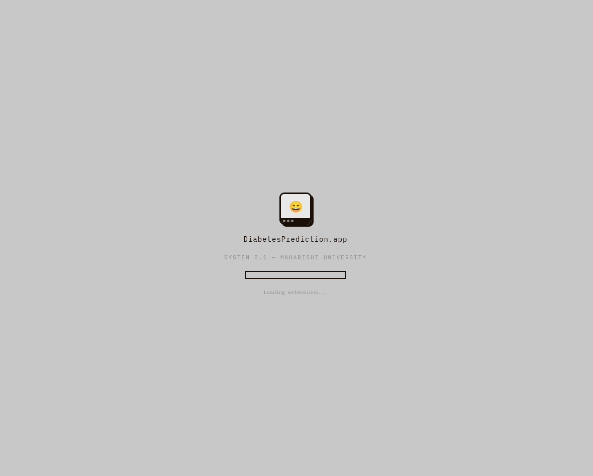
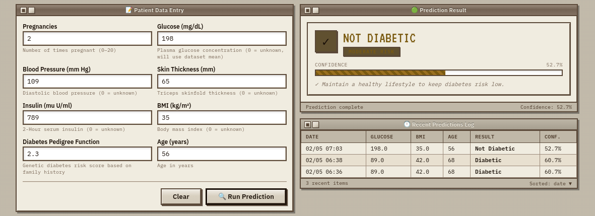
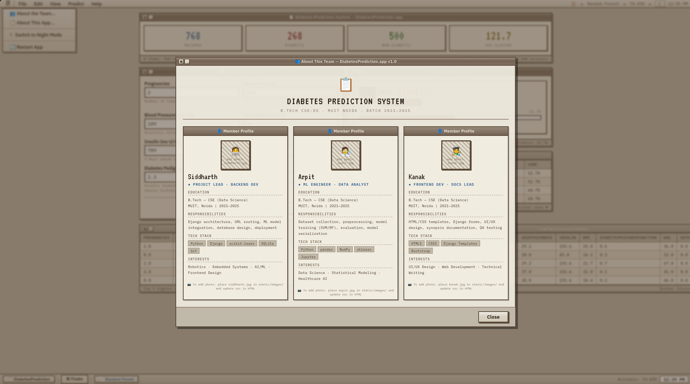
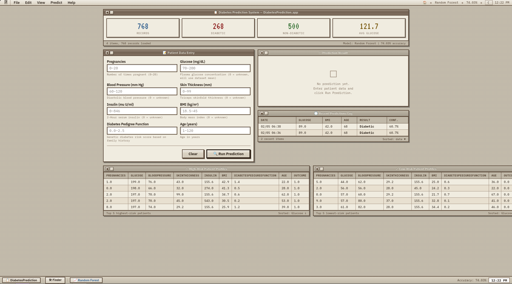
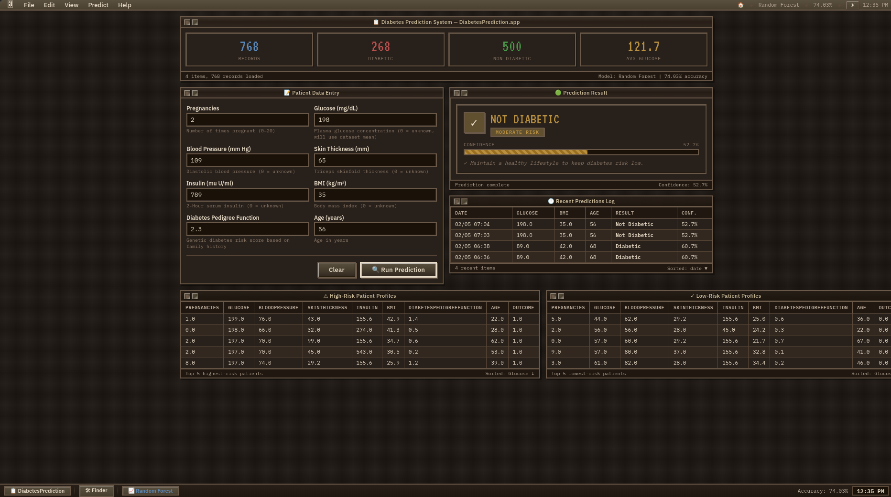

# 🩺 Diagnostic Prediction Suite
> A machine learning–powered web application for diabetes risk analysis, built with Django and scikit-learn — styled with a retro Apple Macintosh System 7/8 interface.

---

## 📸 Screenshots

### 🖥️ Boot Sequence
> *Classic Mac OS boot animation with progress bar and chime sound*

<!-- Add your screenshot here -->


---

### 📊 Dashboard Overview
> *Main interface showing dataset statistics, patient form, and risk profiles*

<!-- Add your screenshot here -->


---

### 🔮 Prediction Form & Result
> *Filled patient form alongside the prediction result with confidence meter*

<!-- Add your screenshot here -->


---

### 👥 Team Info Page
> *Accessed via the  Apple menu → "About the Team"*

<!-- Add your screenshot here -->


---

### ☀️ Day Mode vs 🌙 Night Mode
> *Toggle via the ☾ button in the menu bar or Apple menu*

<!-- Add your screenshots here -->
| Day Mode | Night Mode |
|---|---|
|  |  |

---

## 🧠 About the Project

This project predicts the likelihood of diabetes in a patient using a machine learning classifier trained on the **Pima Indians Diabetes Dataset**. The trained model is served through a full-stack Django web application with an authentic retro Apple Macintosh UI — complete with a boot sequence, sound effects, and day/night mode.

The system accepts 8 health parameters as input and outputs a prediction with a confidence score, risk level, and comparative risk profiles from the dataset.

---

## ✨ Features

- **ML-powered prediction** — Random Forest classifier with `predict_proba()` confidence scoring
- **Proper preprocessing** — Zero values in Glucose, BMI, Insulin, BloodPressure replaced with dataset means before training and at inference time
- **Prediction history** — Every prediction is saved to SQLite and shown in a live log
- **Risk profiling** — Top 5 high-risk and low-risk patient records shown from the dataset
- **Boot animation** — Classic Mac OS grey screen with progress bar and 4-note chime
- **Retro sound effects** — Web Audio API–generated 8-bit beeps on every interaction
- **Team profiles** — Member cards with resume-style details, accessible from the Apple menu
- **Day / Night mode** — Full theme toggle saved to localStorage
- **Responsive layout** — Windows scroll horizontally on smaller screens without breaking layout

---

## 🗂️ Project Structure

```
theme_apple/
├── diabetes_project/
│   ├── settings.py
│   ├── urls.py
│   ├── diabetes.csv              ← Pima Indians Diabetes Dataset
│   └── diabetes_model_bundle.pkl ← Trained model + scaler + metadata
├── predictor/
│   ├── ml_service.py             ← Model loaded once at startup
│   ├── views.py                  ← Request handling & prediction logic
│   ├── models.py                 ← PredictionRecord DB model
│   ├── forms.py                  ← DiabetesForm with validators
│   ├── urls.py
│   ├── migrations/
│   └── templates/
│       └── index.html            ← Full Mac OS retro UI
├── manage.py
└── README.md
```

---

## ⚙️ Tech Stack

| Layer | Technology |
|---|---|
| Backend | Python 3.10+, Django 5.x |
| Machine Learning | scikit-learn, pandas, NumPy |
| Database | SQLite 3 (via Django ORM) |
| Frontend | HTML5, CSS3, Django Templates |
| Fonts | IBM Plex Sans, IBM Plex Mono, VT323 (Google Fonts) |
| Audio | Web Audio API (no files needed) |

---

## 📦 Dataset

**Pima Indians Diabetes Dataset** — Originally from the National Institute of Diabetes and Digestive and Kidney Diseases.

| Feature | Description |
|---|---|
| Pregnancies | Number of times pregnant |
| Glucose | Plasma glucose concentration (2-hr OGTT) |
| BloodPressure | Diastolic blood pressure (mm Hg) |
| SkinThickness | Triceps skinfold thickness (mm) |
| Insulin | 2-hour serum insulin (mu U/ml) |
| BMI | Body mass index (kg/m²) |
| DiabetesPedigreeFunction | Genetic risk score |
| Age | Age in years |
| Outcome | 1 = Diabetic, 0 = Not Diabetic |

Zero values in Glucose, BloodPressure, SkinThickness, Insulin, and BMI represent missing data and are replaced with column means during preprocessing.

---

## 🤖 Model Details

Three classifiers were trained and compared:

| Model | Test Accuracy | CV (5-fold) |
|---|---|---|
| Random Forest | ~74–77% | ~75% |
| SVM (RBF kernel) | ~72–75% | ~74% |
| Gradient Boosting | ~73–76% | ~74% |

The best-performing model is saved as `diabetes_model_bundle.pkl` which contains the model, scaler, feature names, zero-replacement means, and accuracy metadata — loaded once at Django startup via `ml_service.py`.

---

## 🚀 Installation & Running

### Prerequisites

```bash
# Install Python (Arch Linux)
sudo pacman -S python python-pip

# Or on Ubuntu/Debian
sudo apt install python3 python3-pip
```

### Setup

```bash
# 1. Unzip and enter the project
unzip Diabetes_Apple90s_v2.zip
cd theme_apple

# 2. Install dependencies
pip install django scikit-learn pandas numpy

# If Arch gives "externally managed environment" error:
pip install django scikit-learn pandas numpy --break-system-packages

# Or use a virtual environment (recommended)
python -m venv venv
source venv/bin/activate
pip install django scikit-learn pandas numpy
```

### Run

```bash
# Apply database migrations
python manage.py migrate

# Start the development server
python manage.py runserver
```

Then open your browser and go to:
```
http://127.0.0.1:8000/
```

---

## 🖼️ Adding Member Photos

1. Create the folder: `predictor/static/images/`
2. Add your photos named exactly: `siddharth.jpg`, `arpit.jpg`, `kanak.jpg`
3. In `predictor/templates/index.html`, find the `member-photo-placeholder` div for each member and replace it with:

```html

```

---

## 👨‍💻 Team

**Bachelor of Technology — CSE with Data Science**
Maharishi University of Information Technology, Noida
Session 2021–2025

| Member | Role |
|---|---|
| **Siddharth** | Backend Development, Django Architecture, ML Integration, UI |
| **Arpit** | Machine Learning, Data Preprocessing, Model Training & Evaluation |
| **Kanak** | Frontend Development, Django Templates, Documentation & QA |

---

## 📚 References

1. J. W. Smith et al., *Using the ADAP learning algorithm to forecast the onset of diabetes mellitus*, 1988
2. I. Kavakiotis et al., *Machine Learning and Data Mining Methods in Diabetes Research*, CSBJ, 2017
3. D. Sisodia & D. S. Sisodia, *Prediction of Diabetes using Classification Algorithms*, Procedia CS, 2018
4. Django Documentation — https://docs.djangoproject.com
5. scikit-learn Documentation — https://scikit-learn.org
6. Pima Indians Diabetes Database — https://www.kaggle.com/uciml/pima-indians-diabetes-database

---

## ⚠️ Disclaimer

This application is a student academic project and is **not intended for clinical use**. Predictions should not be used as a substitute for professional medical diagnosis. Always consult a qualified healthcare provider.

---

*Built with ❤️ and way too much attention to Mac OS 8 UI details.*
